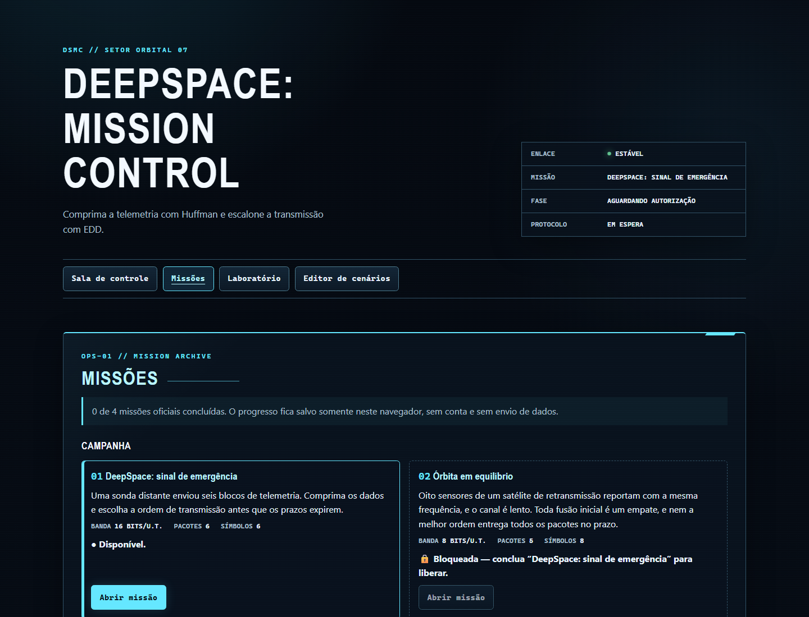
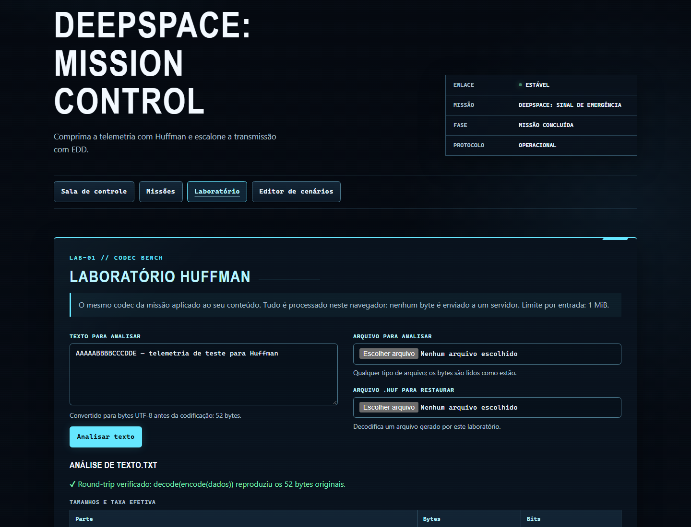

# DeepSpace: Mission Control

> Jogo educacional point & click sobre Codificação de Huffman e escalonamento
> Earliest Due Date (EDD) aplicado a transmissões espaciais.

O **DeepSpace: Mission Control** coloca o jogador no controle da comunicação
com uma sonda. Durante uma janela limitada de contato, o operador comprime
pacotes de telemetria com Huffman e escolhe sua ordem de transmissão para
reduzir o maior atraso.

O projeto foi desenvolvido para a disciplina **Projeto de Algoritmos**, da
Universidade de Brasília — FGA, no módulo de **Algoritmos Ambiciosos**.

## Entrega

- [Aplicação publicada no GitHub Pages](https://projeto-de-algoritmos-2026.github.io/G10_Greedy_PA-26.2/)
- [Relatório técnico](docs/relatorio.md)
- [Link Video Apresentação Youtube](https://youtu.be/Baj9YF2PVUw)
- [Roteiro do vídeo](docs/roteiro-video.md)
- [Issues do projeto](https://github.com/projeto-de-algoritmos-2026/G10_Greedy_PA-26.2/issues)

## Capturas da aplicação

### Campanha e seleção de missões



### Construção da árvore de Huffman


### Escalonamento EDD


### Relatório da missão


### Laboratório



## Funcionalidades

- quatro missões oficiais com progressão salva no navegador;
- construção manual da árvore de Huffman com min-heap e comparação com a
  referência ótima;
- codec binário real, com serialização da árvore, cabeçalho, payload e padding;
- representação alternativa por Huffman canônico e benchmark reproduzível;
- escalonador interativo EDD, métricas de atraso e gráficos de Gantt;
- relatório calculado a partir das escolhas do jogador;
- laboratório para comprimir textos e arquivos e restaurar contêineres `.huf`;
- editor para importar, validar, exportar e jogar cenários em JSON;
- execução inteiramente local e publicação estática no GitHub Pages.

## Problema e algoritmos

A telemetria é dividida em pacotes com conteúdos, tamanhos e prazos diferentes.
O canal até a Terra tem largura de banda limitada. A aplicação conecta duas
decisões:

1. **Huffman:** constrói um código de prefixo a partir das frequências. Para uma
   entrada com `n` símbolos e alfabeto de tamanho `σ`, contar frequências custa
   `O(n)` e construir a árvore com a min-heap custa `O(σ log σ)`.
2. **EDD:** ordena os pacotes por prazo não decrescente em `O(m log m)`. No
   modelo adotado — um canal, todos os pacotes disponíveis em `t = 0` e sem
   preempção — essa ordem minimiza o maior atraso.

A compressão altera as durações das transmissões, mas não altera a regra de
ordenação EDD. A fundamentação, as complexidades e as limitações estão no
[relatório técnico](docs/relatorio.md).

## Arquitetura

A aplicação não possui backend. Algoritmos, simulação, persistência do progresso
e leitura de arquivos executam no navegador; nenhum dado do usuário é enviado a
um serviço externo.

```text
src/
├── algorithms/  # min-heap, Huffman, codecs e EDD
├── domain/      # validação, transmissão, relatório e laboratório
├── game/        # comandos, estado, progressão e seletores
├── components/  # sala e terminais React
├── data/        # quatro missões oficiais
├── infra/       # localStorage, leitura e download de arquivos
├── styles/      # identidade visual e responsividade
└── test/        # utilitários e fixtures de teste
```

Veja a [estrutura detalhada do projeto](docs/estrutura-do-projeto.md).

## Como executar a partir de um clone

Pré-requisito: **Node.js 22** (a versão esperada está em `.nvmrc`).

```bash
git clone https://github.com/projeto-de-algoritmos-2026/G10_Greedy_PA-26.2.git
cd G10_Greedy_PA-26.2
npm ci
npm run dev
```

O Vite mostra no terminal o endereço local, normalmente
`http://localhost:5173/`.

### Verificações e build de produção

```bash
npm run lint
npm run typecheck
npm run test
npm run format:check
npm run build
npm run preview
```

O build estático é gerado em `dist/`. Em produção, o Vite usa a base
`/G10_Greedy_PA-26.2/`, compatível com o caminho do repositório no GitHub Pages.

Benchmark reproduzível das representações por árvore e canônica:

```bash
npm run bench:canonical
```

## Documentação

- [Relatório técnico e resultados](docs/relatorio.md)
- [Roteiro da apresentação](docs/roteiro-video.md)
- [Estrutura e arquitetura](docs/estrutura-do-projeto.md)
- [Formato binário Huffman](docs/formato-huffman.md)
- [Huffman canônico e benchmarks](docs/huffman-canonico.md)
- [Escalonamento EDD](docs/escalonamento-edd.md)
- [Formato das missões, progressão e editor](docs/formato-missao.md)
- [Modo laboratório](docs/modo-laboratorio.md)
- [Validação integrada do MVP](docs/validacao-mvp.md)

## Qualidade e entrega contínua

Pull requests e atualizações da branch principal executam lint, testes e build
no GitHub Actions. O deploy do GitHub Pages só ocorre após a conclusão dessas
verificações. A suíte cobre os algoritmos, codecs, domínio, persistência e
componentes; também verifica o round-trip das missões oficiais e compara EDD
com todas as 720 ordens da missão principal.

## Autoria

- Gustavo Xavier Evangelista
- Lucas A. Zanetti

## Licença

Distribuído sob a licença MIT. Consulte [LICENSE](LICENSE).
