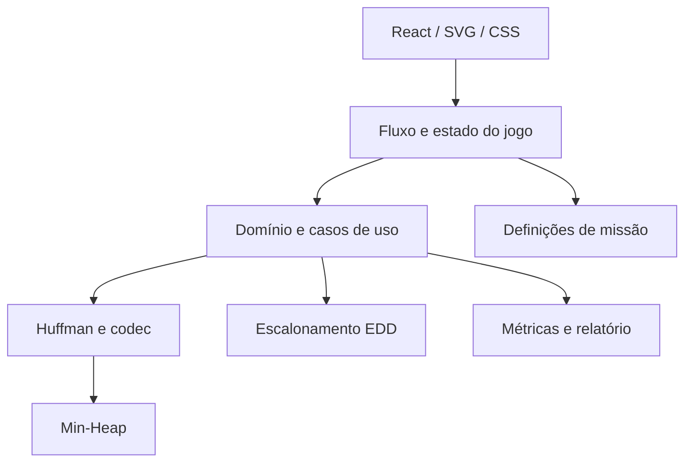

# Estrutura do projeto — DeepSpace: Mission Control

## 1. Visão geral

**DeepSpace: Mission Control** é uma experiência educacional point & click que
transforma dois algoritmos ambiciosos em mecânicas de uma missão espacial:

- a **Codificação de Huffman** reduz o volume de telemetria transmitido;
- **Earliest Due Date (EDD)** ordena os pacotes para minimizar o maior atraso.

O jogador opera terminais de uma sala de controle, toma as decisões dos
algoritmos, pode manter escolhas diferentes das recomendadas e observa o impacto
dessas escolhas nas métricas finais.

O software será uma aplicação web estática. Toda a simulação, codificação e
visualização acontece no navegador, sem backend remoto.

## 2. Objetivo geral

Construir uma aplicação interativa que permita executar, visualizar e comparar
Huffman e EDD dentro de um problema coerente de comunicação com largura de banda
limitada.

O projeto deve demonstrar que:

1. escolhas locais do algoritmo de Huffman produzem um código de prefixo ótimo;
2. uma escolha diferente ainda pode formar um código válido, mas deve ser
   avaliada pelo custo final, principalmente na presença de empates;
3. a compressão reduz a duração das transmissões de acordo com os dados de cada
   pacote;
4. ordenar por deadlines não decrescentes minimiza o maior atraso no modelo
   adotado;
5. os resultados exibidos decorrem da simulação, e não de valores previamente
   escritos na interface.

## 3. Público e proposta de valor

O público principal são estudantes de algoritmos e pessoas interessadas em
visualizações educacionais. A proposta combina:

- explicação algorítmica;
- experimentação livre;
- feedback imediato;
- narrativa curta;
- comparação quantitativa entre estratégias.

## 4. Escopo do MVP

### 4.1 Experiência

- uma missão completa;
- uma sala de controle com áreas clicáveis;
- briefing e objetivo mensurável;
- navegação entre telemetria, compressão, escalonamento e relatório;
- retorno visual para estados incompletos, válidos e incorretos;
- execução sem cronômetro real obrigatório.

### 4.2 Huffman

- alfabeto pequeno o suficiente para manipulação visual;
- tabela de frequências obtida dos dados da missão;
- min-heap implementada no projeto;
- extração e combinação dos dois menores pesos;
- construção automática de referência;
- construção manual pelo jogador;
- aceitação de empates válidos;
- geração dos códigos de prefixo;
- codificação em bits, empacotamento em bytes e decodificação;
- comparação do comprimento médio e do tamanho resultante.

### 4.3 Escalonamento

- um único canal de transmissão;
- todos os pacotes disponíveis no tempo inicial;
- transmissões não preemptivas;
- duração derivada do tamanho comprimido e da largura de banda;
- reordenação manual dos pacotes;
- solução automática EDD;
- cálculo de início, término, atraso e maior atraso;
- gráfico de Gantt e indicação visual dos deadlines.

### 4.4 Relatório

- quantidade de pacotes transmitidos;
- tamanho original e tamanho comprimido;
- tamanho do cabeçalho e padding;
- taxa efetiva de compressão;
- comprimento médio dos códigos;
- decisões de Huffman compatíveis com o algoritmo;
- tempo total de transmissão;
- maior atraso;
- pacotes entregues dentro do prazo;
- comparações jogador × referência e sem Huffman × com Huffman.

## 5. Fora do escopo do MVP

- autenticação e contas;
- backend remoto ou banco de dados;
- comunicação em tempo real;
- multiplayer;
- editor completo de missões;
- múltiplos capítulos narrativos;
- Huffman adaptativo;
- compactador de uso geral;
- gráficos ou cenários 3D;
- relógio que possa impedir o estudo do algoritmo.

Esses limites protegem a entrega acadêmica e evitam que elementos visuais reduzam
o tempo destinado aos algoritmos e aos testes.

## 6. Modelo algorítmico

### 6.1 Representação da telemetria

A missão define um alfabeto finito de símbolos e distribui sequências desses
símbolos entre os pacotes. O formato original de cada símbolo precisa ser
declarado para que a comparação de tamanhos seja reproduzível.

Uma única árvore de Huffman é construída para o buffer completo da missão e
compartilhada pelos pacotes. Assim, cada pacote possui uma duração diferente de
acordo com sua própria distribuição de símbolos, embora todos usem o mesmo
código.

O relatório separa:

```text
bits efetivos = bits do cabeçalho + bits codificados + bits de padding
```

O cabeçalho é transmitido antes dos pacotes. Seu tempo pode ser tratado como um
custo inicial comum do cenário comprimido. A interface também apresenta a taxa
teórica sem cabeçalho para fins didáticos, sempre com os valores identificados.

### 6.2 Huffman

Para cada símbolo `s`, sejam `f(s)` sua frequência e `l(s)` o comprimento de seu
código:

```text
comprimento médio = Σ f(s) × l(s) / Σ f(s)
```

Etapas:

1. contar as frequências;
2. criar uma folha para cada símbolo;
3. inserir as folhas na min-heap;
4. extrair os dois menores nós;
5. criar um pai com peso igual à soma;
6. reinserir o pai e repetir;
7. percorrer a árvore para gerar os códigos;
8. codificar e empacotar os bits;
9. reconstruir e decodificar para verificar integridade.

Complexidade para entrada de tamanho `n` e alfabeto de tamanho `σ`:

- frequências: `O(n)`;
- árvore: `O(σ log σ)`;
- geração da tabela: `O(σ)`;
- codificação e decodificação: lineares no volume processado.

Empates serão resolvidos por um critério determinístico apenas para tornar
replays e testes reproduzíveis. Árvores alternativas de mesmo custo continuam
válidas.

### 6.3 Escalonamento EDD

Para cada pacote `j`:

- `p_j`: duração de transmissão;
- `d_j`: deadline;
- `C_j`: instante de conclusão;
- `T_j = max(0, C_j - d_j)`: atraso não negativo.

O objetivo é minimizar:

```text
T_max = max(T_j)
```

No modelo adotado, ordenar os pacotes por `d_j` não decrescente é ótimo. A
compressão altera `p_j`, `C_j` e `T_max`, mas não a regra de ordenação. A duração
é calculada por:

```text
tempo de transmissão = bits efetivos / largura de banda em bits por segundo
```

O projeto usa a sigla EDD para maior precisão. A interface pode informar que os
slides da disciplina apresentam a mesma estratégia como Earliest Deadline First.

## 7. Arquitetura

### 7.1 Princípios

- algoritmos são funções e estruturas TypeScript independentes do React;
- domínio da missão não depende de componentes visuais;
- componentes consomem casos de uso e modelos já calculados;
- dados das missões são declarativos e validados na carga;
- nenhuma biblioteca externa implementa os algoritmos estudados;
- o estado necessário para reproduzir uma missão é serializável;
- todas as métricas possuem uma única fonte de verdade.

### 7.2 Camadas



#### Apresentação

Contém sala de controle, terminais, árvore, heap, Gantt e relatório. Não calcula
regras algorítmicas diretamente.

#### Aplicação e jogo

Coordena o fluxo da missão, comandos do jogador, desbloqueio dos terminais e
comparação entre a solução manual e a referência.

#### Domínio

Define missão, pacotes, telemetria, largura de banda, deadlines, bitstreams e
resultados. Também conecta compressão e escalonamento.

#### Algoritmos

Implementações puras da min-heap, Huffman, codec de bits e EDD. Essa camada não
importa React, APIs do navegador nem dados visuais.

#### Infraestrutura do navegador

Responsável por download, upload futuro, armazenamento local futuro e publicação
estática. Não existe servidor de aplicação.

### 7.3 Estrutura planejada

```text
src/
├── algorithms/
│   ├── heap/
│   │   ├── MinHeap.ts
│   │   └── MinHeap.test.ts
│   ├── huffman/
│   │   ├── types.ts
│   │   ├── buildTree.ts
│   │   ├── buildCodeTable.ts
│   │   ├── bitstream.ts
│   │   ├── codec.ts
│   │   └── huffman.test.ts
│   └── scheduling/
│       ├── earliestDueDate.ts
│       ├── metrics.ts
│       └── scheduling.test.ts
├── domain/
│   ├── mission.ts
│   ├── telemetry.ts
│   ├── packet.ts
│   ├── transmission.ts
│   └── report.ts
├── game/
│   ├── state/
│   ├── commands/
│   ├── simulation/
│   └── selectors/
├── components/
│   ├── ControlRoom/
│   ├── TelemetryTerminal/
│   ├── CompressionTerminal/
│   ├── TransmissionScheduler/
│   ├── MissionReport/
│   └── shared/
├── data/
│   └── missions/
├── assets/
├── styles/
├── App.tsx
└── main.tsx
docs/
├── estrutura-do-projeto.md
├── relatorio.md
└── images/
```

## 8. Estado e fluxo do jogo

Estados principais:

```text
briefing
  -> investigating
  -> building-code
  -> compressed
  -> scheduling
  -> transmitted
  -> report
```

O estado deve registrar separadamente:

- dados imutáveis da missão;
- progresso do jogador;
- histórico de combinações da árvore;
- solução Huffman de referência;
- ordem manual dos pacotes;
- ordem EDD de referência;
- métricas derivadas.

Métricas derivadas não devem ser duplicadas no estado se puderem ser recalculadas
com segurança.

## 9. Stack tecnológica

| Tecnologia | Responsabilidade |
|---|---|
| React | Telas, componentes e interação |
| TypeScript | Algoritmos, domínio e segurança de tipos |
| Vite | Servidor de desenvolvimento e build estático |
| HTML/CSS | Estrutura, layout e estética retrofuturista |
| SVG | Árvore de Huffman, heap e gráfico de Gantt |
| Vitest | Testes unitários e de propriedades |
| Testing Library | Testes de interação dos componentes |
| ESLint/Prettier | Qualidade e formatação |
| GitHub Actions | Testes e build contínuos |
| GitHub Pages | Hospedagem estática |

Bibliotecas visuais só serão adicionadas quando reduzirem trabalho sem esconder a
lógica estudada. O projeto não usará bibliotecas de Huffman, heap ou scheduling.

## 10. Estratégia de testes

### 10.1 Min-heap

- mínimo sempre ocupa a raiz;
- inserção e extração preservam a propriedade da heap;
- duplicatas e heap vazia são tratadas;
- sequência de extrações é não decrescente.

### 10.2 Huffman

- todos os símbolos recebem códigos;
- nenhum código é prefixo de outro;
- frequências do pai correspondem à soma dos filhos;
- empates produzem resultados válidos e reproduzíveis;
- entrada vazia e alfabeto unitário são tratados;
- `decode(encode(dados))` devolve exatamente os dados originais;
- tamanho efetivo inclui cabeçalho e padding.

### 10.3 Scheduling

- EDD ordena deadlines de forma não decrescente;
- início e término são cumulativos;
- atraso nunca é negativo na métrica apresentada;
- para seis pacotes, as 720 permutações confirmam que EDD minimiza o maior
  atraso;
- empates de deadline mantêm um desempate determinístico.

### 10.4 Integração e interface

- completar Huffman desbloqueia o scheduler;
- alterar a árvore atualiza os tamanhos e tempos;
- alterar a ordem atualiza Gantt e relatório;
- reiniciar a missão restaura o estado inicial;
- navegação principal funciona por teclado;
- movimento reduzido desativa animações não essenciais.

## 11. Acessibilidade e experiência

- hotspots também aparecem na ordem de tabulação;
- todos os controles possuem nome acessível;
- estado não é comunicado somente por cor;
- contraste é verificado mesmo com o tema CRT;
- diagramas possuem alternativa textual;
- animações respeitam `prefers-reduced-motion`;
- mensagens explicam o efeito da escolha sem punir experimentação.

## 12. Build e publicação

O build do Vite gera somente arquivos estáticos. Uma GitHub Action deverá:

1. instalar dependências com lockfile;
2. executar lint e testes;
3. gerar o build de produção;
4. publicar o artefato no GitHub Pages apenas após sucesso.

O caminho-base do Vite deverá considerar o nome do repositório
`G10_Greedy_PA-26.2`.

## 13. Marcos do projeto

### M1 — Base algorítmica

Aplicação inicial, min-heap, Huffman, codec, EDD e testes unitários.

### M2 — Simulação integrada

Modelo da missão, estado do jogo e ligação entre compressão, banda e atraso.

### M3 — Experiência point & click

Sala de controle, terminais, árvore, Gantt e relatório.

### M4 — MVP e entrega

Acessibilidade, integração, GitHub Pages, documentação e vídeo.

### Pós-MVP — Expansões

Funcionalidades exploratórias que não bloqueiam a entrega acadêmica.

## 14. Definição de pronto do MVP

O MVP estará pronto quando:

- uma pessoa conseguir concluir a missão sem instrução externa;
- Huffman e EDD forem implementados diretamente e testados;
- a telemetria for realmente codificada e decodificada;
- o relatório usar somente valores calculados;
- as comparações algorítmicas forem tecnicamente corretas;
- testes, lint e build passarem na integração contínua;
- a aplicação estiver acessível no GitHub Pages;
- README, relatório e vídeo explicarem problema, solução e complexidade;
- houver commits graduais e contribuição observável dos dois integrantes.

## 15. Continuação após o MVP

A evolução deve preservar a separação entre algoritmos, domínio e interface. A
ordem recomendada é:

1. **Modo laboratório:** aceitar texto ou arquivo do usuário e produzir uma
   análise Huffman fora da narrativa.
2. **Huffman canônico:** reduzir e padronizar a representação do cabeçalho,
   comparando-a com a árvore explícita.
3. **Múltiplas missões:** criar cenários declarativos com distribuições, bandas e
   deadlines diferentes.
4. **Editor de cenários:** validar e importar definições de missão.
5. **Persistência e progressão:** salvar preferências e resultados localmente.
6. **Imersão adicional:** áudio, novas ambientações e internacionalização, sempre
   mantendo alternativa acessível.

Cada expansão deve possuir métricas e testes próprios. Novas regras de
escalonamento — prioridades, datas de liberação ou preempção — não devem ser
apresentadas como EDD clássico; elas exigem outra modelagem e nova análise de
otimalidade.

## 16. Riscos e respostas

| Risco | Resposta |
|---|---|
| Arte consumir o prazo | Uma sala, quatro terminais e SVG/CSS simples no MVP |
| Métricas artificiais | Derivar tudo dos bitstreams e do scheduler |
| Arquivos pequenos crescerem | Separar payload, cabeçalho e total efetivo |
| Empates serem marcados como erro | Avaliar custo final e aceitar escolhas equivalentes |
| React conter regras de algoritmo | Manter a camada `algorithms/` sem dependência visual |
| Expansões atrasarem a entrega | Isolar todas na milestone Pós-MVP |
