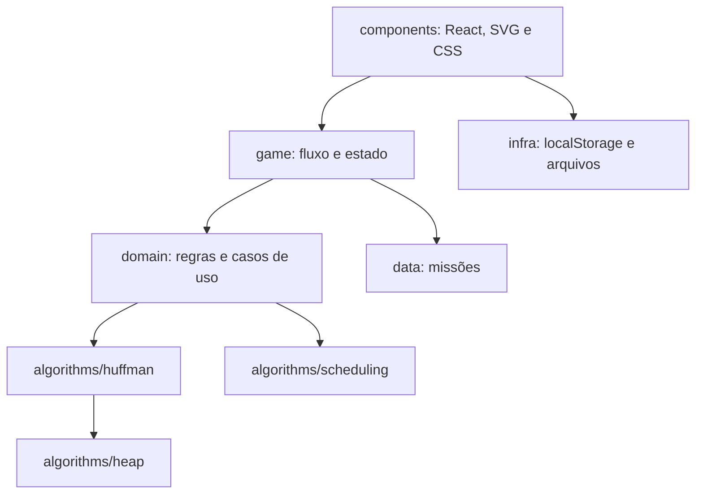
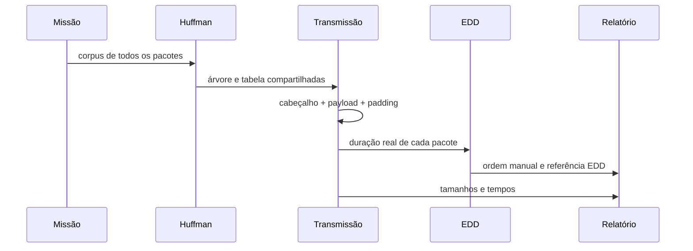

# Estrutura do projeto — DeepSpace: Mission Control

## Visão geral

O **DeepSpace: Mission Control** é uma aplicação web educacional que integra
Codificação de Huffman e Earliest Due Date (EDD) em uma missão de comunicação
espacial. O jogador constrói uma árvore, comprime pacotes reais, organiza a
transmissão e recebe um relatório calculado a partir de suas decisões.

O sistema é inteiramente estático. Simulação, codec, persistência e arquivos do
laboratório são processados no navegador, sem API, banco de dados ou backend.

## Organização das camadas


```mermaid
flowchart TB
    UI[components: React, SVG e CSS] --> GAME[game: fluxo e estado]
    GAME --> DOMAIN[domain: regras e casos de uso]
    DOMAIN --> HUFF[algorithms/huffman]
    DOMAIN --> EDD[algorithms/scheduling]
    HUFF --> HEAP[algorithms/heap]
    GAME --> DATA[data: missões]
    UI --> INFRA[infra: localStorage e arquivos]
```

| Camada         | Conteúdo                                                           | Regra principal                               |
| -------------- | ------------------------------------------------------------------ | --------------------------------------------- |
| Algoritmos     | min-heap, Huffman, codecs, representação canônica e EDD            | não depende de React nem de APIs do navegador |
| Domínio        | carga e validação de missões, transmissão, relatório e laboratório | conecta algoritmos sem guardar estado visual  |
| Jogo           | fases, comandos, seletores, sessões e progressão                   | alterações passam por comandos validados      |
| Apresentação   | sala, terminais, árvore, Gantt, editor e laboratório               | exibe modelos já calculados                   |
| Dados          | quatro missões oficiais declarativas                               | usa o mesmo schema dos cenários importados    |
| Infraestrutura | armazenamento, leitura e download                                  | isola APIs do navegador                       |

## Estrutura atual

```text
.
├── .github/workflows/
│   ├── ci.yml                         # lint, testes e build
│   └── deploy.yml                     # publicação no GitHub Pages
├── docs/                              # relatório e documentação temática
├── scripts/
│   ├── benchmark-canonical.mjs        # entrada executável do benchmark
│   └── canonicalBenchmark.ts          # cenários e tabelas do benchmark
├── src/
│   ├── algorithms/
│   │   ├── heap/                      # MinHeap genérica
│   │   ├── huffman/                   # árvore, tabelas, codecs e canônico
│   │   └── scheduling/                # EDD e métricas do cronograma
│   ├── components/                    # componentes e terminais React
│   ├── data/                          # definições das missões oficiais
│   ├── domain/                        # regras integradas e relatórios
│   ├── game/                          # estado, comandos e progressão
│   ├── infra/                         # localStorage, arquivos e downloads
│   ├── styles/                        # estilos globais e responsivos
│   ├── test/                          # fixtures e utilitários de teste
│   ├── App.tsx                        # composição e navegação principal
│   └── main.tsx                       # entrada da aplicação
├── vite.config.ts                     # Vite, Vitest e base do Pages
└── package.json                       # scripts e dependências
```

Os testes ficam ao lado dos módulos que exercitam, com sufixos `.test.ts` ou
`.test.tsx`. Essa proximidade torna explícito qual comportamento protege cada
arquivo.

## Modelo de missão

Uma `MissionDefinition` declarativa contém:

- identificador, título, briefing e objetivos;
- largura de banda em bits por unidade de tempo;
- alfabeto e tamanho original de cada símbolo;
- pacotes com identificador, prazo e payload.

`validateMissionDocument` valida documentos oficiais e importados. `loadMission`
converte arrays externos em estruturas internas imutáveis, conta frequências,
constrói a árvore de referência e deriva o cabeçalho compartilhado. Regras e
limites estão em [Formato de missão](formato-missao.md).

## Fluxo e estado do jogo

As fases formam esta máquina de estados:

```text
briefing
  → investigation
  → compression
  → scheduling
  → transmission
  → report
```

Os comandos em `game/commands.ts` são o único caminho para avançar fases,
registrar fusões, desfazer uma fusão, alterar a ordem dos pacotes e concluir a
transmissão. Um comando inválido devolve o estado original e um erro tipado.

O estado serializável guarda:

- missão e fase atuais;
- pares escolhidos nas fusões de Huffman;
- ordem manual dos identificadores de pacotes.

Árvore, tabela de códigos, ordem EDD, cronogramas e relatório são derivados por
seletores. Assim, uma métrica não fica duplicada em estado e apresentação.

## Integração entre Huffman e EDD


```mermaid
sequenceDiagram
    participant M as Missão
    participant H as Huffman
    participant T as Transmissão
    participant E as EDD
    participant R as Relatório
    M->>H: corpus de todos os pacotes
    H->>T: árvore e tabela compartilhadas
    T->>T: cabeçalho + payload + padding
    T->>E: duração real de cada pacote
    E->>R: ordem manual e referência EDD
    T->>R: tamanhos e tempos
```

A árvore usa as frequências do corpus completo. O cabeçalho é pago uma vez; o
payload e o padding são calculados separadamente por pacote. A duração usada no
scheduler é `(payload + padding) / largura de banda`, com o custo do cabeçalho
como instante inicial comum.

O relatório compara:

- original × comprimido;
- árvore do jogador × Huffman de referência;
- ordem manual × EDD;
- tempo, atraso máximo e pacotes entregues no prazo.

## Persistência e arquivos

O progresso usa `localStorage` com schema versionado. Na restauração, cada
resultado, sessão e cenário personalizado volta a ser validado antes de entrar
no jogo. Um registro inconsistente é descartado sem impedir a execução.

No laboratório, `TextEncoder`, `Blob.arrayBuffer` e URLs locais processam textos
e arquivos. Os contêineres `.huf` não são enviados pela rede. O round-trip é
verificado antes de habilitar o download restaurado.

## Interface e acessibilidade

- navegação principal e terminais usam controles HTML nativos;
- ações de reordenação possuem botões para teclado além de arrastar e soltar;
- foco retorna ao terminal correspondente ao fechar uma área;
- tabelas usam títulos e cabeçalhos semânticos;
- estados importantes usam regiões `status` e `alert`;
- a página inclui link para pular ao conteúdo principal;
- diagramas possuem alternativa textual quando não são legíveis.

## Build, CI e deploy

O Vite gera a aplicação em `dist/`. Durante o build, a base é
`/G10_Greedy_PA-26.2/`, permitindo que scripts e estilos sejam resolvidos no
caminho do repositório.

O workflow de CI roda em pull requests e na branch principal. Ele instala com
`npm ci` e executa lint, testes e build. O workflow de deploy depende da mesma
validação e publica o artefato estático no GitHub Pages; uma falha interrompe a
publicação.

## Documentos relacionados

- [Relatório técnico](relatorio.md)
- [Roteiro do vídeo](roteiro-video.md)
- [Formato binário Huffman](formato-huffman.md)
- [Huffman canônico e benchmarks](huffman-canonico.md)
- [Escalonamento EDD](escalonamento-edd.md)
- [Formato de missão, progressão e editor](formato-missao.md)
- [Modo laboratório](modo-laboratorio.md)
- [Validação integrada](validacao-mvp.md)
