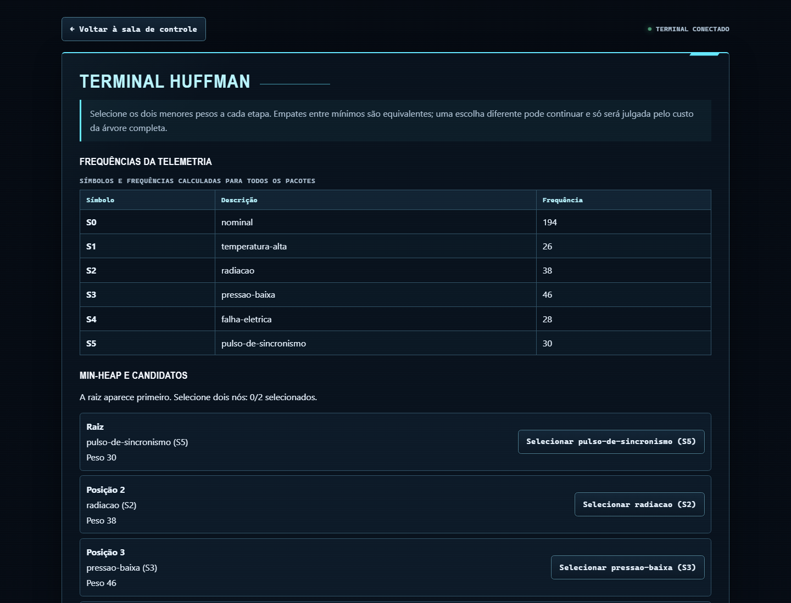
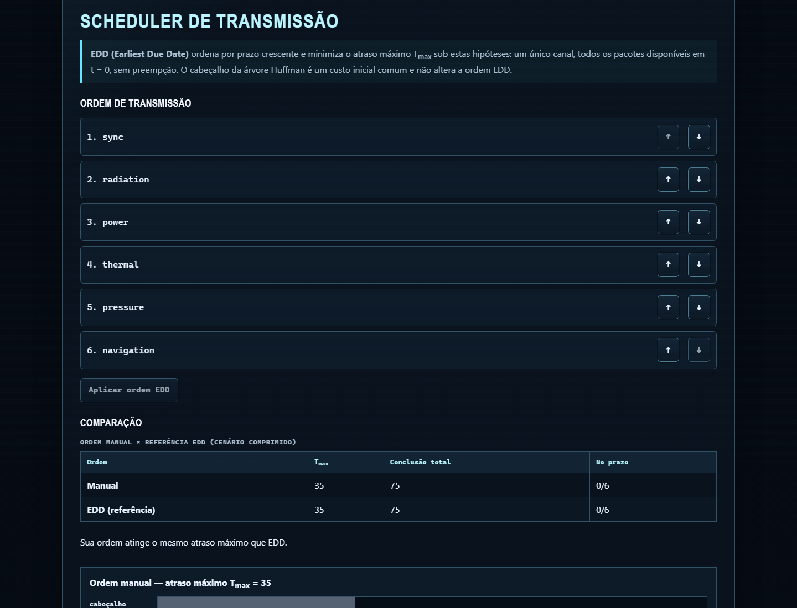
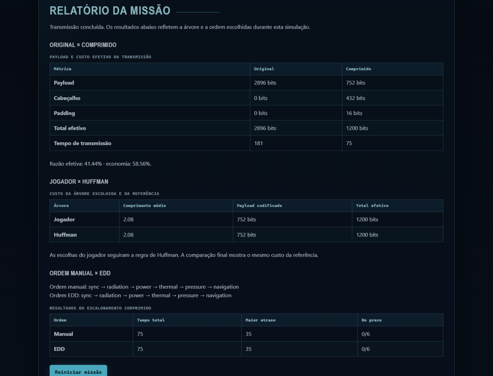

# Relatório técnico — DeepSpace: Mission Control

## 1. Identificação

| Campo       | Valor                                                              |
| ----------- | ------------------------------------------------------------------ |
| Disciplina  | Projeto de Algoritmos — Universidade de Brasília, FGA              |
| Módulo      | Algoritmos Ambiciosos                                              |
| Projeto     | DeepSpace: Mission Control                                         |
| Integrantes | Gustavo Xavier Evangelista e Lucas A. Zanetti                      |
| Aplicação   | <https://projeto-de-algoritmos-2026.github.io/G10_Greedy_PA-26.2/> |
| Repositório | <https://github.com/projeto-de-algoritmos-2026/G10_Greedy_PA-26.2> |

## 2. Resumo

O projeto transforma Codificação de Huffman e Earliest Due Date (EDD) em duas
etapas conectadas de uma missão espacial. Primeiro, o jogador constrói uma
árvore de Huffman para comprimir a telemetria. Depois, ordena os pacotes
resultantes para reduzir o maior atraso de transmissão.

A aplicação não usa valores decorativos: frequências, códigos, tamanhos,
durações e atrasos são calculados a partir dos dados da missão e das escolhas do
jogador. O produto final é uma aplicação React e TypeScript totalmente estática,
executada no navegador e publicada no GitHub Pages.

## 3. Problema e modelagem

Uma missão contém um alfabeto de telemetria e `m` pacotes. Cada pacote `j` tem:

- uma sequência de símbolos;
- um prazo `d_j`;
- uma duração de transmissão `p_j`, calculada a partir do tamanho em bits e da
  largura de banda.

Uma única árvore de Huffman é construída com o corpus formado pela concatenação
de todos os pacotes. Essa tabela compartilhada permite que a distribuição de
cada pacote produza uma duração diferente, pagando o cabeçalho da árvore uma
única vez antes da transmissão.

Para uma ordem de pacotes, a conclusão e o atraso são:

```text
C_j = instante em que a transmissão do pacote j termina
T_j = max(0, C_j - d_j)
T_max = max(T_j)
```

O objetivo do escalonamento é minimizar `T_max`. O cabeçalho Huffman é modelado
como um custo inicial comum: ele desloca todas as conclusões, mas não muda qual
ordem EDD é escolhida.

## 4. Fluxo da solução


Na interface, a sequência aparece como briefing, investigação, construção da
árvore, escalonamento, transmissão e relatório. O jogador pode manter uma fusão
fora da regra gulosa e comparar o custo final com a referência, além de montar
uma ordem de pacotes diferente de EDD e observar o efeito em `T_max`.

## 5. Arquitetura

A separação em camadas mantém os algoritmos independentes do React:

| Camada           | Responsabilidade                                                |
| ---------------- | --------------------------------------------------------------- |
| `src/algorithms` | min-heap, Huffman, codecs por árvore e canônico, EDD e métricas |
| `src/domain`     | schema de missão, transmissão, relatório e laboratório          |
| `src/game`       | estado, comandos, fases, progressão e seletores                 |
| `src/components` | sala de controle, terminais, tabelas, árvore e Gantt            |
| `src/data`       | quatro missões oficiais declarativas                            |
| `src/infra`      | `localStorage`, leitura de arquivos e downloads locais          |

As definições de missão passam pelo mesmo schema usado pelo editor. O estado
salvo contém apenas decisões e progresso; árvores, métricas e relatórios são
reconstruídos. Isso reduz a possibilidade de divergência entre valores exibidos
e valores calculados.

## 6. Codificação de Huffman

### 6.1 Estratégia gulosa

Para cada símbolo `s`, sua frequência `f(s)` vira uma folha. Uma min-heap mantém
os nós ativos ordenados por peso. A cada iteração:

1. são extraídos os dois nós de menor peso;
2. cria-se um nó pai com a soma dos pesos;
3. o novo nó volta para a heap;
4. o processo continua até restar a raiz.

Combinar os dois menores pesos é a escolha gulosa de Huffman. A interface
identifica essa escolha em cada etapa, aceita empates e também permite continuar
com outro par para comparar o resultado completo. Empates são resolvidos de
forma determinística no código para tornar testes e replays reproduzíveis.

Após a árvore, um percurso associa `0` à aresta esquerda e `1` à direita. O
comprimento médio do código é:

```text
L = Σ f(s) × comprimento(código(s)) / Σ f(s)
```

### 6.2 Codec binário

O codec trabalha com `Uint8Array`. Os códigos são empacotados em bytes e o
último byte recebe padding quando necessário. O cabeçalho `HUF` registra versão,
tamanho original, quantidade de bits úteis, padding e a árvore em pré-ordem. A
decodificação reconstrói a árvore sem depender do estado da interface.

O laboratório somente oferece o resultado depois de verificar byte a byte:

```text
decode(encode(dados)) === dados
```

O [formato binário completo](formato-huffman.md) documenta os campos e as
validações contra contêineres inconsistentes.

### 6.3 Huffman canônico

Também foi implementada a representação `HUC`, que preserva apenas os
comprimentos dos códigos. Os símbolos são ordenados por comprimento e valor, e
os códigos são reconstruídos por uma regra determinística. O payload mantém o
mesmo número de bits da árvore equivalente, enquanto o cabeçalho costuma ser
menor.

O benchmark do projeto mostra que a representação canônica reduz de forma
estável a memória da estrutura de decodificação para alfabetos maiores, mas não
há vencedor consistente em tempo. Em entradas pequenas ou uniformes, o
cabeçalho pode superar toda a economia do payload. Resultados e metodologia
estão em [Huffman canônico e benchmarks](huffman-canonico.md).

## 7. Escalonamento Earliest Due Date

EDD ordena os pacotes por prazo não decrescente. A implementação usa ordenação
estável, então pacotes com o mesmo prazo preservam sua ordem relativa. Depois da
ordenação, um percurso acumula início, conclusão e atraso de cada transmissão.

### 7.1 Por que EDD é ótimo neste projeto

Considere dois pacotes adjacentes fora da ordem de prazo: `i` aparece antes de
`j`, mas `d_i > d_j`. Trocar o par não altera o intervalo total ocupado e não
afeta os demais pacotes. Colocar primeiro o pacote de menor prazo não aumenta o
maior atraso do par. Repetindo essa troca para todas as inversões, obtém-se uma
ordem EDD sem piorar `T_max`.

### 7.2 EDD não é um escalonador geral

A garantia usada depende simultaneamente destas hipóteses:

- existe um único canal, equivalente a uma única máquina;
- todos os pacotes estão disponíveis em `t = 0`;
- não há preempção, precedências nem tempos de preparação;
- o objetivo é minimizar o maior atraso não negativo.

A regra não é apresentada como solução automática para modelos com vários
canais, datas de liberação, prioridades ou pesos, interrupção de tarefas,
dependências, setups ou objetivos como soma dos atrasos, número de tarefas
atrasadas ou tempo médio de conclusão. Por isso o schema do editor rejeita
campos que representariam esses modelos sem a análise correspondente.

## 8. Complexidades

Considere `n` símbolos no corpus, `σ` símbolos distintos, `B` bits no payload
codificado, `Lmax` o maior código e `m` pacotes.

| Operação                            |                      Tempo |             Espaço adicional |
| ----------------------------------- | -------------------------: | ---------------------------: |
| Contar frequências                  |                     `O(n)` |                       `O(σ)` |
| Inserir ou extrair da min-heap      |                 `O(log σ)` |          `O(1)` além da heap |
| Construir a árvore de Huffman       |               `O(σ log σ)` |                       `O(σ)` |
| Gerar a tabela pela árvore          |                     `O(σ)` |                       `O(σ)` |
| Codificar e empacotar               |                 `O(n + B)` |                   `O(σ + B)` |
| Decodificar pela árvore             |                     `O(B)` | `O(n + σ)` incluindo a saída |
| Gerar códigos canônicos             |               `O(σ log σ)` |                       `O(σ)` |
| Decodificar canônico                | `O(n × Lmax)` no pior caso | `O(n + σ)` incluindo a saída |
| Ordenar por EDD                     |               `O(m log m)` |                       `O(m)` |
| Calcular um cronograma              |                     `O(m)` |                       `O(m)` |
| Enumerar todas as ordens nos testes |                `O(m! × m)` |             `O(m)` por ordem |

A enumeração fatorial não é usada pela aplicação. Ela existe apenas como
oráculo de teste para missões pequenas.

## 9. Resultados da missão principal

A missão `deep-space-alpha` tem 362 símbolos distribuídos em seis pacotes. O
oráculo independente da validação obteve frequências `194, 26, 38, 46, 28, 30`
para os símbolos `0..5`, com comprimentos de código `1, 4, 3, 3, 4, 3`.

### 9.1 Compressão teórica e efetiva

A compressão **teórica** considera somente o payload produzido pelos códigos.
A compressão **efetiva** inclui tudo que precisa ser transmitido: cabeçalho,
payload e padding.

| Métrica                 |  Original |   Huffman |
| ----------------------- | --------: | --------: |
| Payload                 | 2896 bits |  752 bits |
| Cabeçalho               |    0 bits |  432 bits |
| Padding                 |    0 bits |   16 bits |
| Total efetivo           | 2896 bits | 1200 bits |
| Tempo a 16 bits/unidade |       181 |        75 |

Portanto:

```text
razão teórica = 752 / 2896 ≈ 25,97%
economia teórica ≈ 74,03%

razão efetiva = 1200 / 2896 ≈ 41,44%
economia efetiva ≈ 58,56%
```

Ocultar o cabeçalho faria a compressão parecer 15,47 pontos percentuais melhor
do que o custo realmente transmitido. Essa diferença é exibida porque o
overhead domina entradas pequenas e pode transformar uma aparente economia em
expansão.

### 9.2 Escalonamento

A ordem EDD comprimida é:

```text
sync → radiation → power → thermal → pressure → navigation
```

Ela produz `T_max = 35`. A ordem original dos pacotes produz `T_max = 67`. Um
teste enumera as `6! = 720` ordens e confirma que nenhuma obtém valor menor que
35 para esse cenário.

## 10. Evidências visuais







O laboratório e a progressão da campanha aparecem nas demais capturas do
[README](../README.md#capturas-da-aplicação).

## 11. Verificação

A suíte automatizada cobre min-heap, árvore, tabelas, codecs, entradas inválidas,
schema das missões, transmissão, relatório, comandos, persistência e interface.
Entre os testes integrados estão:

- round-trip do corpus e de cada pacote das quatro missões oficiais;
- comparação das métricas principais com um oráculo numérico independente;
- enumeração das 720 ordens da missão principal;
- validação de resultados declarados nos briefings;
- build de produção com a base do GitHub Pages.

O CI executa lint, testes e build em pull requests e na branch principal. O
workflow de Pages só publica depois dessas verificações. Evidências detalhadas e
gates de validação manual estão em [Validação integrada do MVP](validacao-mvp.md).

## 12. Limitações

- O terminal de investigação de telemetria apenas apresenta a transição da fase;
  frequências e símbolos são explorados no terminal Huffman.
- O formato canônico é uma alternativa de código e benchmark, mas o laboratório
  continua exportando o `HUF` com árvore explícita para permitir a visualização.
- Os benchmarks usam corpora sintéticos e seus tempos dependem da máquina e da
  versão do Node.js.
- O laboratório limita entradas a 1 MiB e processa na thread principal do
  navegador.
- O progresso usa `localStorage`; limpar os dados do site remove resultados,
  tentativas e cenários personalizados.
- Não existe backend, conta, sincronização entre dispositivos ou colaboração em
  tempo real.
- A prova e a implementação de EDD valem somente para o modelo descrito na
  seção 7.2.

## 13. Reprodutibilidade

Com Node.js 22:

```bash
npm ci
npm run lint
npm run typecheck
npm run test
npm run build
npm run bench:canonical
```

O build é estático. Depois de `npm run build`, `npm run preview` permite revisar
localmente os mesmos arquivos enviados ao GitHub Pages.

## 14. Conclusão

O projeto integra duas decisões gulosas em uma mesma cadeia de dados. Huffman
reduz os tempos de processamento usados pelo scheduler, e EDD usa esses tempos
para minimizar o maior atraso sob hipóteses explícitas. A interface torna
visíveis não apenas as soluções de referência, mas também o custo de escolhas
alternativas e a diferença entre ganho teórico e custo efetivo.

## Referências

- HUFFMAN, D. A. _A Method for the Construction of Minimum-Redundancy Codes_.
  Proceedings of the IRE, v. 40, n. 9, p. 1098–1101, 1952.
- PINEDO, M. L. _Scheduling: Theory, Algorithms, and Systems_. 6. ed. Springer, 2022.
